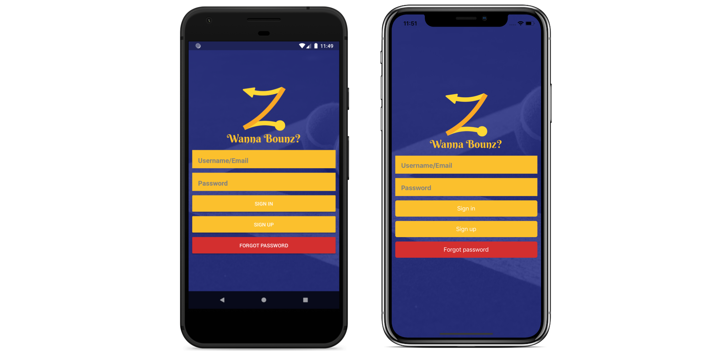

# Bounz (Client)

Bounz is a fun new way to share image-centric posts with an effectively unlimited amount of people. The basic premise is that once you post something, your followers will receive it whereafter they have the option of "bounzing" it to their followers through a fun gesture so that they too will receive it. This can theoretically continue until you have reached everyone on the platform (if your post is good enough...).

Bounz is not meant to replace any of your current social apps but rather provides an entirely new and exciting experience whereby you can create and edit awesome pics (with our even more awesome editor) or help promote the awesome pics of others.

Bounz not only introduces the concept of uhm well bounzing, but we also bring you the concept of courts! Courts are for communities and groups. Courts allow for the grouping of content related in any way you can imagine. Whether members of a res want to post together or if you just want to connect with people who share a hobby, courts are for you!

This repository contains the source code for the Bounz social media app frontend/client. It needs an active backend https://github.com/Gerharddc/BounzSystem/tree/master to talk to in order to be useable. There is, at the time of writing, one running on AWS, but unless someone is willing to take over the responsibility of running it, it will probably close down soon due to cost reasons. In this case you will need to spin up your own instance of the backend and change the source code of the client to point to it.

At the time of writing, the latest build of the app is available at https://play.google.com/store/apps/details?id=io.bounz.bounzapp or https://apps.apple.com/us/app/bounz/id1377356037?ls=1 (albeit only in South Africa) and you can check out https://www.bounz.io as well. If the backend is closed down, these services apps will unfortunately stop working and have to be removed.

Bounz was developed by a group of university students in their spare time with the hope of revolutionizing social media, but unfortunately the platform failed to gain traction and we were forced to abandon the project due to financial and time constraints. We felt it be a waste to just throw away the code and instead give the community an opportunity to transform it into an open source and therefore 100% transparent social media platform.

As it stands, the app is fully functional albeit with a few bugs, obviously, but should still be able to serve as a solid platform with a more reasonable set of features. Currently implemented features include posting, bounzing, commenting, mentioning users and creating invites to events.

As previously stated, we unfortunately do not presently have the means to run this project and do not have time to document it properly either, so anyone wanting to use it will have to do a fair bit of digging and figuring out. If someone is willing to take ownership of the project or sponsor its development please get in touch. Otherwise, feel free to fork it and create something awesome!

This is a React Native based application so you will have to read through the instructions at https://facebook.github.io/react-native/docs/getting-started to get up and running. The app includes a fair but of native code so unfortunately it cannot make use of Expo and has to be built the hard way...

The bounz.keystore file has been deliberately left out in the android folder for security reasons, so you will have to create it yourself before you can build it for android.

You have to run "yarn jetify" and "yarn" before "npx react-native run-android".
